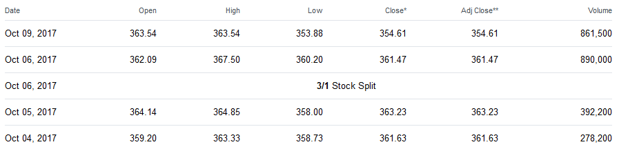
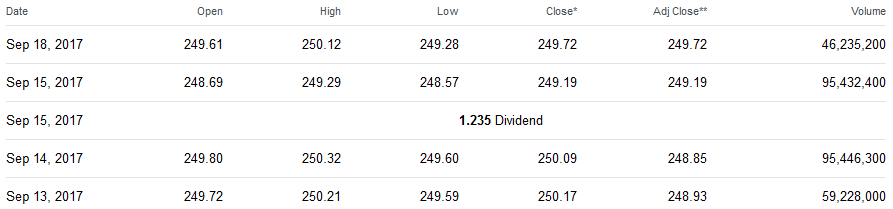
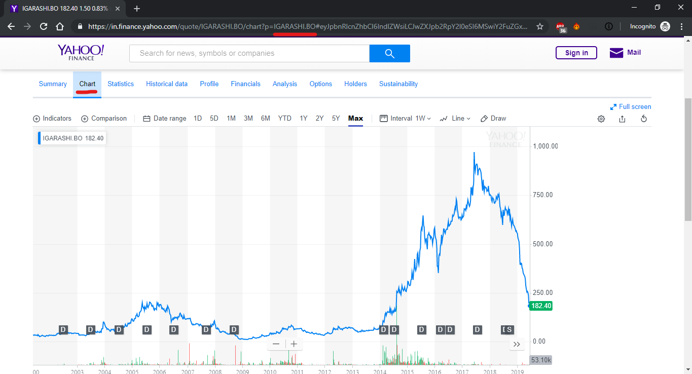
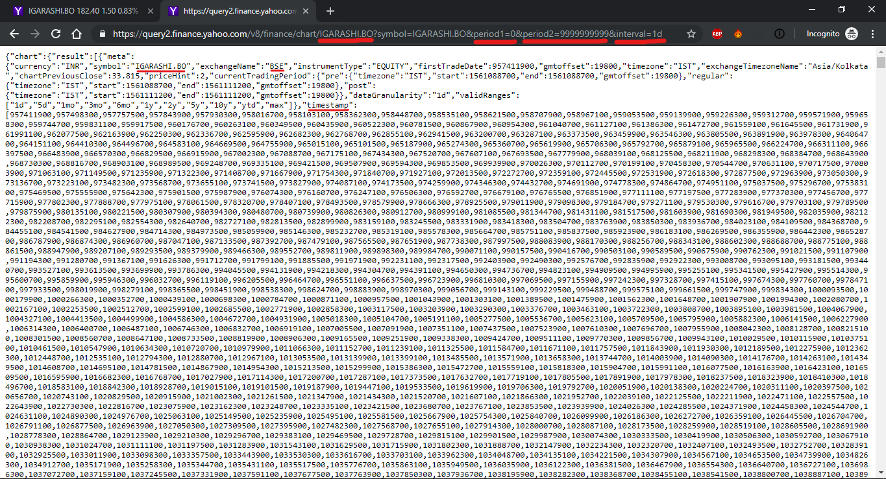
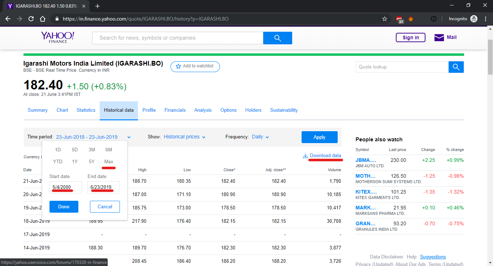
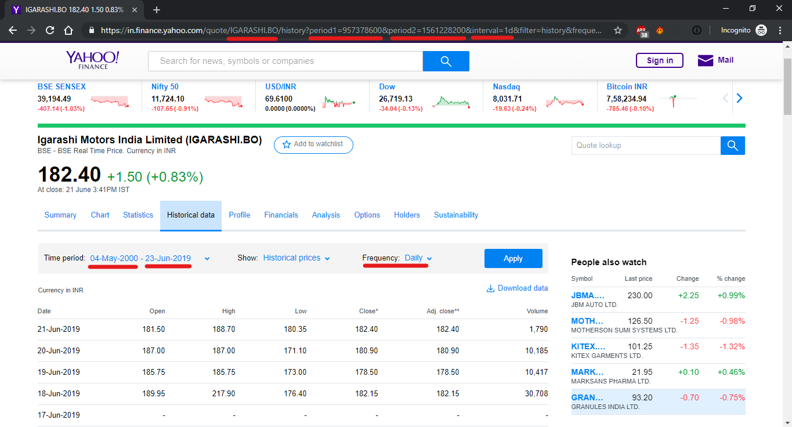

<h1 style="text-align: center;">stock-market-scraper</h1>

<br/>

#### Always wanted to get live updated historical data of your favourite stocks?   

### ***Say no more!***

**stock-market-scraper** is a command line tool which downloads all historical stock data in both `csv` and `json` formats from **[Yahoo Finance](https://in.finance.yahoo.com/)**. This is for educational and reasearch purposes only.

> Don't overuse this script. It puts loads on [Yahoo Finance](https://in.finance.yahoo.com/) servers.

<br/>

### This README is for mass downloading with Pyhton Script only. For only selected stock downloads, see the [Jupyter Notebook](https://github.com/Gunjan933/stock-market-scraper/blob/master/stock-market-scraper.ipynb).

<br/>
<br/>
<br/>


<br/>
<br/>


## Table of Contents

* [Getting Started](#getting-started)
    * [Supported Site](#supported-sites)
    * [Configuring Downloads](#configuring-download-list)
* [Dependencies Installation](#dependencies-installation)
    * [Linux/Debian](#linuxdebian-)
    * [Windows](#windows-)
    * [Mac OS X](#mac-os-x-)
* [Python Support](#python-support)
* [Usage](#usage)
    * [Windows](#windows)
    * [Linux/Debian](#linuxdebian)
* [Save Location](#save-location)
* [Scraping Idea](#lets-see-the-scraping-idea)
    * [Hosts](#hosts)
    * [Fundamental Data](#fundamental-data)
        * [Query](#inputs-for-the-modules-query)
        * [Example Query](#example-url)
    * [Options Contracts](#options-contracts)
        * [Example Url](#example-full-url)
    * [Price](#price)
        * [Intervals](#intervals)
        * [Add pre and post market data](#add-pre--post-market-data)
        * [Add dividents and splits](#add-dividends--splits)
        * [Example](#example-full-query)
    * [Dividents and Splits](#dividents-and-splits)
* [Understanding Code](#now-lets-get-back-to-some-code-to-get-historic-prices-of-stocks)
    * [Modules](#import-some-modules)
    * [Checking Internet](#lets-make-a-code-snippet-which-can-tell-if-we-have-working-internet-connection-or-not)
    * [Function for pulling and saving historical data](#now-write-down-the-function-which-will-get_historic_price-for-given-query_url)
    * [Getting Tickers](#getting-tickers)
* [Future Plans](#future-plans)
    * [Short Term](#short-term)
    * [Long Term](#long-term)
* [Known Bugs](#bugs)
* [Changelog](#changelog)
* [Opening An Issue/Requesting A Site](#opening-an-issuerequesting-a-site)
    * [Reporting Issues](#reporting-issues)
    * [Suggesting A Feature](#suggesting-a-feature)
* [Source](#source)
* [License](#license)

## Getting Started

### Supported Sites

Currently supports **[Yahoo Finance](https://in.finance.yahoo.com/)** only.


### Configuring download list

It currently just downloads all stock data for all over the world from [Yahoo Finance](https://in.finance.yahoo.com/).

I am working on command line argument version where you will be able to download selected stocks with this snippet too.


## Dependencies Installation

This script can run on multiple Operating Systems. Follow the instructions mentioned below, according to your OS.

### Linux/Debian :
Since most (if not all) Linux/Debian OS come with python pre-installed, you don't have to install python manually. Make sure you're using python >= 3.5 though.

We need `pip` to install any external dependenc(ies). So, open any terminal and type in `pip list` and if it shows some data, then it is fine. But, if it shows error, like `pip not found` or something along this line, then you need to install `pip`. Just type this command in terminal :

```
sudo apt-get install python-pip
```

If you're on Fedora, CentOS/RHEL, openSUSE, Arch Linux, then you simply need to follow [`THIS TUTORIAL`](https://packaging.python.org/install_requirements_linux/) to install `pip`.

If this still doesn't work, then you'll manually need to install pip. Doing so is an easy one time job and you can follow   [`THIS TUTORIAL`](https://pip.pypa.io/en/stable/installing/) to do so.

* Download this [`requirements.text`](https://github.com/Gunjan933/stock-market-scraper/blob/master/requirements.txt) file and put it in some directory/folder.
* Open terminal again and browse to the directory where you downloaded your requiremenets.txt file and run this command :
```
pip install -r requirements.txt
```
* It should install the required external libraries.


### Windows :
If you're on windows, then follow these steps :

* Install Python >= 3.5. Download the desired installer from [download Python](https://www.python.org/downloads/).
* [Add it in the system path](http://superuser.com/questions/143119/how-to-add-python-to-the-windows-path) (if not already added).
* Download this [`requirements.text`](https://github.com/Gunjan933/stock-market-scraper/blob/master/requirements.txt) file and put it in some directory/folder.
* Open Command Prompt and browse to the directory where you downloaded your requiremenets.txt file and run this command :
```
pip install -r requirements.txt
```
* It should install the required external libraries.

Now, install Node.Js as well and make sure it's in your path.

Well, if everything came up good without any error(s), then you're good to go!

### Mac OS X :
Mac OS X users will have to fetch their version of `Python` and `Pip`.
* Python installation guide : [Install python on mac os X](http://docs.python-guide.org/en/latest/starting/install/osx/)
* Pip installation guide : [Installing pip on mac os X](http://stackoverflow.com/questions/17271319/installing-pip-on-mac-os-x)

After downloading and installing these, you need to add PIP & Python in your path. Follow [`THIS LITTLE GUIDE`](http://www.pyladies.com/blog/Get-Your-Mac-Ready-for-Python-Programming/) to install both, Python & pip successfully.


## Python Support

Supports python >= 3.5    

## Usage

Follow the instructions according to your OS :

### Windows
After you've saved this script in a directory/folder, you need to open `command prompt` and browse to that directory and then execute the script. Let's do it step by step :
* Open the folder where you've downloaded the files of this repository.
* Hold down the **`SHIFT`** key and while holding down the SHIFT key, **`RIGHT CLICK`** and select `Open Command Prompt Here` from the options that show up.
* Now, in the command prompt, type this :

```
python comicMaker.py
```


### Linux/Debian
After you've saved this script in a directory/folder, you need to open `command prompt` and browse to that directory and then execute the script. Let's do it step by step :
* Open a terminal, `Ctrl + Alt + T` is the shortcut to do so (if you didn't know).
* Now, change the current working directory of the terminal to the one where you've downloaded this repository.
* Now, in the Terminal, type this :
```
python comicMaker.py
```

## Save Location

Comics will be saved on the same directory you clone this repository. Here is how: 
```diff
-     --SomeDirectory (Where you cloned the repository)
        |--stock-market-scraper
        |  |--requirements.txt
        |  |--.gitignore
        |  |--_config.yml
        |  |--stock-market-scraper.py
        |  |--stock-market-scraper.ipnyb
        |  |--readme.md
-       |--historic_data
        |  |--json
        |  |  |--(>63000) files.json
        |  |--csv
        |  |  |--(>61000) files.csv

```


## Let's see the scraping idea
<br/>

**Yahoo has gone to a Reactjs front end which means if you analyze the request headers from the client to the backend you can get the actual JSON they use to populate the client side stores.**


<br/>

### Hosts:
* `query1.finance.yahoo.com` HTTP/1.0
* `query2.finance.yahoo.com` HTTP/1.1 [difference between HTTP/1.0 & HTTP/1.1](https://stackoverflow.com/questions/246859/http-1-0-vs-1-1)  

If you plan to use a proxy or persistent connections use `query2.finance.yahoo.com`. But for the purposes of this post the host used for the example URLs is not meant to imply anything about the path it's being used with.

> We will use HTTP/1.1


### Fundamental Data
* `/v10/finance/quoteSummary/AAPL?modules=` (Full list of modules below)

(substitute your symbol for: AAPL)

### Inputs for the `?modules=` query:

* ```modules = [
   'assetProfile',
   'incomeStatementHistory',
   'incomeStatementHistoryQuarterly',
   'balanceSheetHistory',
   'balanceSheetHistoryQuarterly',
   'cashflowStatementHistory',
   'cashflowStatementHistoryQuarterly',
   'defaultKeyStatistics',
   'financialData',
   'calendarEvents',
   'secFilings',
   'recommendationTrend',
   'upgradeDowngradeHistory',
   'institutionOwnership',
   'fundOwnership',
   'majorDirectHolders',
   'majorHoldersBreakdown',
   'insiderTransactions',
   'insiderHolders',
   'netSharePurchaseActivity',
   'earnings',
   'earningsHistory',
   'earningsTrend',
   'industryTrend',
   'indexTrend',
   'sectorTrend' ]
   ```
#### Example URL:

* `https://query1.finance.yahoo.com/v10/finance/quoteSummary/AAPL?modules=assetProfile%2CearningsHistory`

Querying for: `assetProfile` and `earningsHistory`

The `%2C` is the Hex representation of `,` and needs to be inserted between each module you request. [details about the hex encoding bit](https://stackoverflow.com/questions/6182356/what-is-2c-in-a-url) (if you care)  

<br/>

### Options contracts
* `/v7/finance/options/AAPL` (current expiration)
* `/v7/finance/options/AAPL?date=1579219200` (January 17, 2020 expiration)

#### Example Full URL:

* `https://query2.yahoo.finance.com/v7/finance/options/AAPL` (current expiration)
* `https://query2.yahoo.finance.com/v7/finance/options/AAPL?date=1579219200` (January 17, 2020 expiration)

Any valid future expiration represented as a UNIX timestamp can be used in the `?date=` query. If you query for the current expiration the JSON response will contain a list of all the valid expirations that can be used in the `?date=` query. ([here is a post explaining converting human readable dates to unix timestamp in Python](https://stackoverflow.com/questions/3682748/converting-unix-timestamp-string-to-readable-date))  

<br/>

### Price
* `/v8/finance/chart/AAPL?symbol=AAPL&period1=0&period2=9999999999&interval=3mo`  

### Intervals:

* `&interval=3mo` 3 months, going back until initial trading date.
* `&interval=1d` 1 day, going back until initial trading date.
* `&interval=5m` 5 minuets, going back 80(ish) days.
* `&interval=1m` 1 minuet, going back 4-5 days.

How far back you can go with each interval is a little confusing and seems inconsistent. My assumption is that internally yahoo is counting in trading days and my naive approach was not accounting for holidays. Although that's a guess and YMMV.

`period1=`: unix timestamp representation of the date you wish to **start** at. Values below the initial trading date will be rounded up to the initial trading date.

`period2=`: unix timestamp representation of the date you wish to **end** at. Values greater than the last trading date will be rounded down to the most recent timestamp available.

**Note:** *If you query with a `period1=` (start date) that is too far in the past for the interval you've chosen, yahoo will return prices in the `3mo` interval regardless of what interval you requested.*

### Add pre & post market data

`&includePrePost=true`

### Add dividends & splits

`&events=div%2Csplit`

### Example full query:  

* `https://query1.finance.yahoo.com/v8/finance/chart/AAPL?symbol=AAPL&period1=0&period2=9999999999&interval=1d&includePrePost=true&events=div%2Csplit`  

The above request will return all price data for ticker AAPL on a 1 day interval including pre and post market data as well as dividends and splits.

**Note:** *the values used in the price example url for `period1=` & `period2=` are to demonstrate the respective rounding behavior of each input.*


<br/>  

`The above article is taken from `**[here](https://stackoverflow.com/a/47505102/8141330)**`.`

<br/>  


### Dividents and Splits

Yahoo adjusts **all historical** prices to reflect a stock **split**. For example, `ISRG` was trading around $1000 prior to `2017/10/06`. Then on `2017/10/06`, it underwent a 3-for-1 stock split. As you can see, Yahoo's historical prices divided all prices by 3 (both prior to and after `2017/10/06`):
  
    


For **dividends**, let's say stock `ABC` closed at 200 on December 18. Then on December 19, the stock increases in price by `$2` but it pays out a `$1` dividend. In Yahoo's historical prices for XYZ, you will see that it closed at 200 on Dec 18 and 201 on Dec 19. Yahoo factors in the dividend in the **"Adj Close"** column for all the previous days. So the Close for Dec 18 would be 200, but the Adj Close would be 199.

For example, on 2017/09/15, SPY paid out a `$1.235` dividend. Yahoo's historical prices say that SPY's closing price on 2017/09/14 was 250.09, but the Adj Close is 248.85, which is `$1.24` lower. The **Adjusted Close** for the previous days was reduced by the dividend amount.
  


<br/>  

`The above article is taken from `**[here](https://money.stackexchange.com/a/44146)**`.`

<br/>  


<br/>  

## Now let's get back to some Code to get historic prices of stocks
<br/>  


### Import some modules:  
* **urllib**: *To get url data*
* **json**: *To handle json files*
* **time**: *To put the program in sleep for some time*
* **os**: *To walk through different directories*
* **difflib**: *To get close matches of strings. Helps to find correct stock from the input user gives.*
* **itertools**: *To repeat same variable to pass in multithreading funciton.*
* **pandas**: *To handle matrix and csv file*
* **datetime**: *To change unix timestamp to normal date and time. Yahoo query uses unix timestamp*


```python
import urllib.request, json , time, os, difflib, itertools
import pandas as pd
from multiprocessing.dummy import Pool
from datetime import datetime
try:
    import httplib
except:
    import http.client as httplib
```

### Let's make a code snippet which can tell if we have working internet connection or not

<br/>


```python
def check_internet():
    conn = httplib.HTTPConnection("www.google.com", timeout=5)
    try:
        conn.request("HEAD", "/")
        conn.close()
        # print("True")
        return True
    except:
        conn.close()
        # print("False")
        return False
```


<br/>

Now see below, I have opened an arbitrary stock `Igarashi Motors`. In URL can you see the **ticker** for the stock? It is `IGARASHI.BO`

<br/>




<br/>   
<br/>
<br/>

How to get the **ticker**, I will show you later.  

First let us make a **function** that can pull `json data` from yahoo about that stock like below. (I will discuss about the function `parameters` later)
> We will be using query2

<br/>
<br/>
<br/>



<br/>
<br/>


<br/>

### Now write down the function which will `get_historic_price` for given `query_url`.

#### It will save the stock data as `json` and `csv` inside a folder named "historic_data"
<br/>


```python
def get_historic_price(query_url,json_path,csv_path):
    
    stock_id=query_url.split("&period")[0].split("symbol=")[1]

    if os.path.exists(csv_path+stock_id+'.csv') and os.stat(csv_path+stock_id+'.csv').st_size != 0:
        print("<<<  Historical data of "+stock_id+" already exists")
        return
    
    while not check_internet():
        print("Could not connect, trying again in 5 seconds...")
        time.sleep(5)

    try:
        with urllib.request.urlopen(query_url) as url:
            parsed = json.loads(url.read().decode())
    
    except:
        print("|||  Historical data of "+stock_id+" doesn't exist")
        return
    
    else:
        if os.path.exists(json_path+stock_id+'.json') and os.stat(json_path+stock_id+'.json').st_size != 0:
            os.remove(json_path+stock_id+'.json')
        
        with open(json_path+stock_id+'.json', 'w') as outfile:
            json.dump(parsed, outfile, indent=4)
        
        try:
            Date=[]
            for i in parsed['chart']['result'][0]['timestamp']:
                Date.append(datetime.utcfromtimestamp(int(i)).strftime('%d-%m-%Y'))

            Low=parsed['chart']['result'][0]['indicators']['quote'][0]['low']
            Open=parsed['chart']['result'][0]['indicators']['quote'][0]['open']
            Volume=parsed['chart']['result'][0]['indicators']['quote'][0]['volume']
            High=parsed['chart']['result'][0]['indicators']['quote'][0]['high']
            Close=parsed['chart']['result'][0]['indicators']['quote'][0]['close']
            Adjusted_Close=parsed['chart']['result'][0]['indicators']['adjclose'][0]['adjclose']

            df=pd.DataFrame(list(zip(Date,Low,Open,Volume,High,Close,Adjusted_Close)),columns =['Date','Low','Open','Volume','High','Close','Adjusted Close'])

            if os.path.exists(csv_path+stock_id+'.csv'):
                os.remove(csv_path+stock_id+'.csv')
            df.to_csv(csv_path+stock_id+'.csv', sep=',', index=None)
            print(">>>  Historical data of "+stock_id+" saved")
        
        except:
            print(">>>  Historical data of "+stock_id+" could not be saved")
        
        return```

<br/>

#### First we have to set where the `json` and `csv` files will be saved which have been passed to the function `get_historic_price()`
<br/>


```python
json_path = os.getcwd()+os.sep+".."+os.sep+"historic_data"+os.sep+"json"+os.sep
csv_path = os.getcwd()+os.sep+".."+os.sep+"historic_data"+os.sep+"csv"+os.sep
```

   
#### Then we have to check if these directory exists, if not, then we will use `os.mkdir`
  


```python
if not os.path.isdir(json_path):
    os.makedirs(json_path)
if not os.path.isdir(csv_path):
    os.makedirs(csv_path)
```


<br/>
<br/>

## Getting tickers

Now as promised I will be showing how to find **historical data**. See below, I have opened historical data of `Igarashi Motors`. Here you can see max time period from which we can pull data for the stock. It stores period as `unix timestamp` in the query.

<br/>




<br/>   
<br/>
<br/>

Now let's make the **query**. First set
* `period1 = 0`
* `period2 = 9999999999`
* `interval = 1d`  

See the image below, it's `period1` is greater than `0` and `period2` is lesser than `9999999999`. This produces maximum span period from which data can be pulled.

<br/>
<br/>
<br/>



<br/>
<br/>


<br/>  

#### Then we need to open our csv file where `yahoo finance tickers` are saved. This is in the `Assets` folder
<br/>

How did I get this? Well here is the **[direct link](http://investexcel.net/wp-content/uploads/2015/01/Yahoo-Ticker-Symbols-September-2017.zip)** to download the **yahoo ticker list (last updated September 2017)**. It would be helpful for the author if you visit **[his website page](http://investexcel.net/all-yahoo-finance-stock-tickers/)**, as his income is through advertisements, and it takes lots of hours to create this type of ticker list.

All right, moving on.

<br/>


#### Let's now make the funciton to shrink the ticker list.


```python
ticker_file_path = "Assets"+os.sep+"Yahoo Ticker Symbols - September 2017.xlsx"
temp_df = pd.read_excel(ticker_file_path)
print("Total stocks:",len(temp_df))
temp_df.head(10)
```

    Total stocks: 106331
    


<div>
<table border="1" class="dataframe">
  <thead>
    <tr style="text-align: right;">
      <th></th>
      <th>Yahoo Stock Tickers</th>
      <th>Unnamed: 1</th>
      <th>Unnamed: 2</th>
      <th>Unnamed: 3</th>
      <th>Unnamed: 4</th>
      <th>Unnamed: 5</th>
      <th>Unnamed: 6</th>
      <th>Unnamed: 7</th>
    </tr>
  </thead>
  <tbody>
    <tr>
      <th>0</th>
      <td>http://investexcel.net</td>
      <td>NaN</td>
      <td>NaN</td>
      <td>NaN</td>
      <td>NaN</td>
      <td>NaN</td>
      <td>NaN</td>
      <td>NaN</td>
    </tr>
    <tr>
      <th>1</th>
      <td>NaN</td>
      <td>NaN</td>
      <td>NaN</td>
      <td>NaN</td>
      <td>NaN</td>
      <td>NaN</td>
      <td>NaN</td>
      <td>NaN</td>
    </tr>
    <tr>
      <th>2</th>
      <td>Ticker</td>
      <td>Name</td>
      <td>Exchange</td>
      <td>Category Name</td>
      <td>Country</td>
      <td>NaN</td>
      <td>NaN</td>
      <td>NaN</td>
    </tr>
    <tr>
      <th>3</th>
      <td>OEDV</td>
      <td>Osage Exploration and Development, Inc.</td>
      <td>PNK</td>
      <td>NaN</td>
      <td>USA</td>
      <td>NaN</td>
      <td>NaN</td>
      <td>Samir Khan</td>
    </tr>
    <tr>
      <th>4</th>
      <td>AAPL</td>
      <td>Apple Inc.</td>
      <td>NMS</td>
      <td>Electronic Equipment</td>
      <td>USA</td>
      <td>NaN</td>
      <td>NaN</td>
      <td>simulationconsultant@gmail.com</td>
    </tr>
    <tr>
      <th>5</th>
      <td>BAC</td>
      <td>Bank of America Corporation</td>
      <td>NYQ</td>
      <td>Money Center Banks</td>
      <td>USA</td>
      <td>NaN</td>
      <td>NaN</td>
      <td>NaN</td>
    </tr>
    <tr>
      <th>6</th>
      <td>AMZN</td>
      <td>Amazon.com, Inc.</td>
      <td>NMS</td>
      <td>Catalog &amp; Mail Order Houses</td>
      <td>USA</td>
      <td>NaN</td>
      <td>NaN</td>
      <td>This ticker symbol list was downloaded from</td>
    </tr>
    <tr>
      <th>7</th>
      <td>T</td>
      <td>AT&amp;T Inc.</td>
      <td>NYQ</td>
      <td>Telecom Services - Domestic</td>
      <td>USA</td>
      <td>NaN</td>
      <td>NaN</td>
      <td>http://investexcel.net/all-yahoo-finance-stock...</td>
    </tr>
    <tr>
      <th>8</th>
      <td>GOOG</td>
      <td>Alphabet Inc.</td>
      <td>NMS</td>
      <td>Internet Information Providers</td>
      <td>USA</td>
      <td>NaN</td>
      <td>NaN</td>
      <td>and was updated on 2nd September 2017</td>
    </tr>
    <tr>
      <th>9</th>
      <td>MO</td>
      <td>Altria Group, Inc.</td>
      <td>NYQ</td>
      <td>Cigarettes</td>
      <td>USA</td>
      <td>NaN</td>
      <td>NaN</td>
      <td>NaN</td>
    </tr>
  </tbody>
</table>
</div>


<br/>

#### See the above list is messy, it contains garbage informations. So refining it we get
<br/>


```python
temp_df = temp_df.drop(temp_df.columns[[5, 6, 7]], axis=1)
headers = temp_df.iloc[2]
df  = pd.DataFrame(temp_df.values[3:], columns=headers)
print("Total stocks:",len(df))
df.head(10)
```

    Total stocks: 106328
    


<div>
<table border="1" class="dataframe">
  <thead>
    <tr style="text-align: right;">
      <th>2</th>
      <th>Ticker</th>
      <th>Name</th>
      <th>Exchange</th>
      <th>Category Name</th>
      <th>Country</th>
    </tr>
  </thead>
  <tbody>
    <tr>
      <th>0</th>
      <td>OEDV</td>
      <td>Osage Exploration and Development, Inc.</td>
      <td>PNK</td>
      <td>NaN</td>
      <td>USA</td>
    </tr>
    <tr>
      <th>1</th>
      <td>AAPL</td>
      <td>Apple Inc.</td>
      <td>NMS</td>
      <td>Electronic Equipment</td>
      <td>USA</td>
    </tr>
    <tr>
      <th>2</th>
      <td>BAC</td>
      <td>Bank of America Corporation</td>
      <td>NYQ</td>
      <td>Money Center Banks</td>
      <td>USA</td>
    </tr>
    <tr>
      <th>3</th>
      <td>AMZN</td>
      <td>Amazon.com, Inc.</td>
      <td>NMS</td>
      <td>Catalog &amp; Mail Order Houses</td>
      <td>USA</td>
    </tr>
    <tr>
      <th>4</th>
      <td>T</td>
      <td>AT&amp;T Inc.</td>
      <td>NYQ</td>
      <td>Telecom Services - Domestic</td>
      <td>USA</td>
    </tr>
    <tr>
      <th>5</th>
      <td>GOOG</td>
      <td>Alphabet Inc.</td>
      <td>NMS</td>
      <td>Internet Information Providers</td>
      <td>USA</td>
    </tr>
    <tr>
      <th>6</th>
      <td>MO</td>
      <td>Altria Group, Inc.</td>
      <td>NYQ</td>
      <td>Cigarettes</td>
      <td>USA</td>
    </tr>
    <tr>
      <th>7</th>
      <td>DAL</td>
      <td>Delta Air Lines, Inc.</td>
      <td>NYQ</td>
      <td>Major Airlines</td>
      <td>USA</td>
    </tr>
    <tr>
      <th>8</th>
      <td>AA</td>
      <td>Alcoa Corporation</td>
      <td>NYQ</td>
      <td>Aluminum</td>
      <td>USA</td>
    </tr>
    <tr>
      <th>9</th>
      <td>AXP</td>
      <td>American Express Company</td>
      <td>NYQ</td>
      <td>Credit Services</td>
      <td>USA</td>
    </tr>
  </tbody>
</table>
</div>


<br/>  


#### Now create the query urls for the stock `ticker`s. This will bring the query pages, where yahoo finance holds it's historical stock data. 

<br/>

Example query is like this:  `https://query1.finance.yahoo.com/v8/finance/chart/`**ticker**`?symbol=`**ticker**`&period1=0&period2=9999999999&interval=1d&includePrePost=true&events=div%2Csplit`

<br/>  


```python
query_urls=[]
for ticker in df['Ticker']:
    query_urls.append("https://query1.finance.yahoo.com/v8/finance/chart/"+ticker+"?symbol="+ticker+"&period1=0&period2=9999999999&interval=1d&includePrePost=true&events=div%2Csplit")
```

### Now get to the stock datas with multithreading.
<br/>


```python
with Pool(processes=10) as pool:
    pool.starmap(get_historic_price, zip(query_urls, itertools.repeat(json_path), itertools.repeat(csv_path)))
print("<|>  Historical data of all stocks saved")
```

    <<<  Historical data of SBIN.NS already exists, Updating data...
    <<<  Historical data of IGARASHI.NS already exists, Updating data...
    <<<  Historical data of TATAMOTORS.NS already exists, Updating data...
    <<<  Historical data of TCS.NS already exists, Updating data...
    >>>  Historical data of TCS.NS saved
    >>>  Historical data of IGARASHI.NS saved
    >>>  Historical data of TATAMOTORS.NS saved
    >>>  Historical data of SBIN.NS saved
    All downloads completed !
    

## So like this you can update data everyday by yourself
<br/>


## Future plans

### Short term 

- Add command line arguments for ease of use.

### Long term

- Add more websites to download from.

## Bugs

- None

## Changelog

- [Added]  New website [Yahoo Finance](https://in.finance.yahoo.com/)


## Opening An Issue/Requesting A Site

If your're planning to open an issue for the script or ask for a new feature or anything that requires opening an Issue, then please do keep these things in mind.

### Reporting Issues

If you're going to report an issue, please follow this syntax :  
**Command You Gave** : What was the command that you used to invoke the issue?  
**Expected Behaviour** : After giving the above command, what did you expect shoud've happened?  
**Actual Behaviour** : What actually happened?  
**Error Log** : Error Log is mandatory.  

 
### Suggesting A Feature
  
If you're here to make suggestions, please follow the basic syntax to post a request :  
**Subject** : Something that briefly tells us about the feature.  
**Long Explanation** : Describe in details what you want and how you want.  


### Source
* **[Stack Overflow](https://stackoverflow.com/)**
* **[Yahoo Finance](https://in.finance.yahoo.com/)**
* **[Stack Exchange](https://stackexchange.com/)**
* **[Python](https://www.python.org/)**
* **[Geeks for Geeks](https://www.geeksforgeeks.org/)**


## License
**[MIT](https://github.com/Gunjan933/stock-market-scraper/blob/master/LICENSE)**


